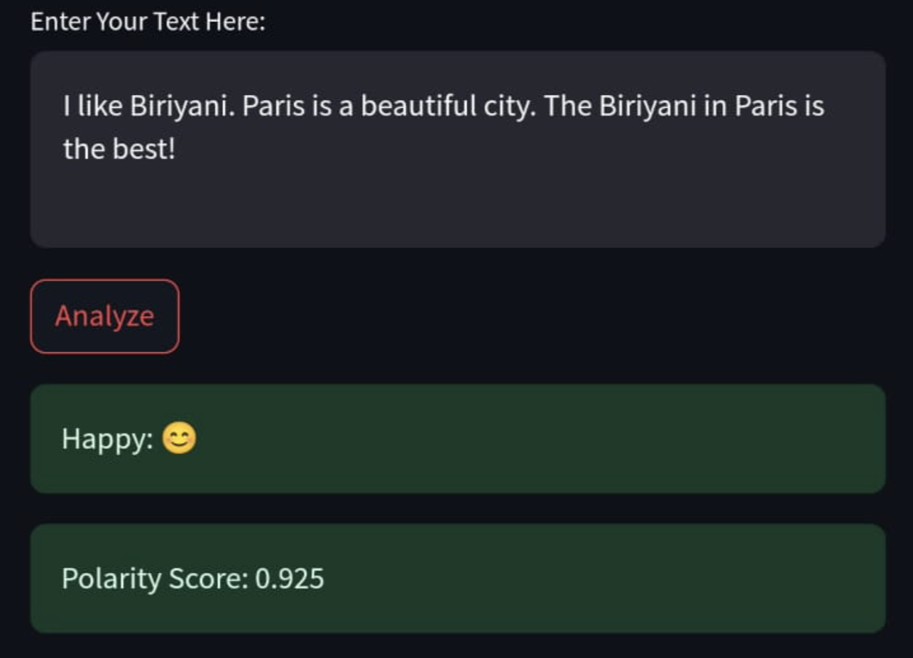

# Sentiment Analysis Using NLTK WordNet Lemmatizer

This application performs sentiment analysis using NLTK's WordNet Lemmatizer.

You can experience the demo of this app <a href="https://djsarkar93-sentimentanalysis1.streamlit.app" target="_blank">here</a>.




## Run Locally

To run the application on your local machine, execute the following commands:

- Clone the project
  ```bash 
  git clone https://github.com/djsarkar1993/sentiment-analyzer-1/tree/main
  ```
- Go to the project directory
  ```bash
  cd sentiment-analyzer-1
  ```
- Install dependencies
  ```bash
  pip install -r requirements.txt
  ```
- Start the application
  ```bash
  streamlit run streamlit_app.py
  ```


## Credits

- [Dibyajyoti Sarkar](www.linkedin.com/in/djsarkar93)


## License

This project is licensed under the [MIT](https://choosealicense.com/licenses/mit/) License.
